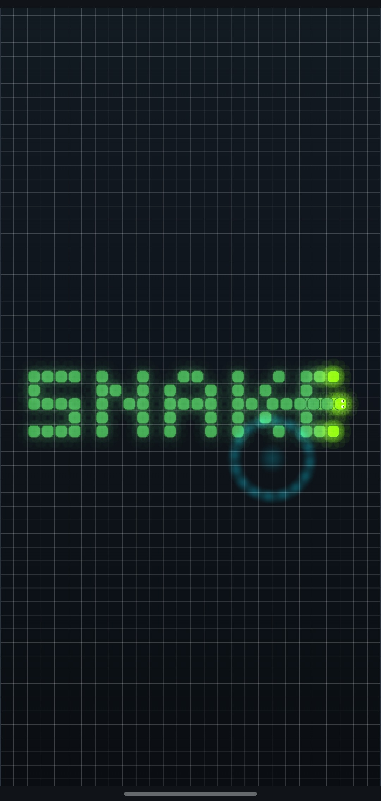
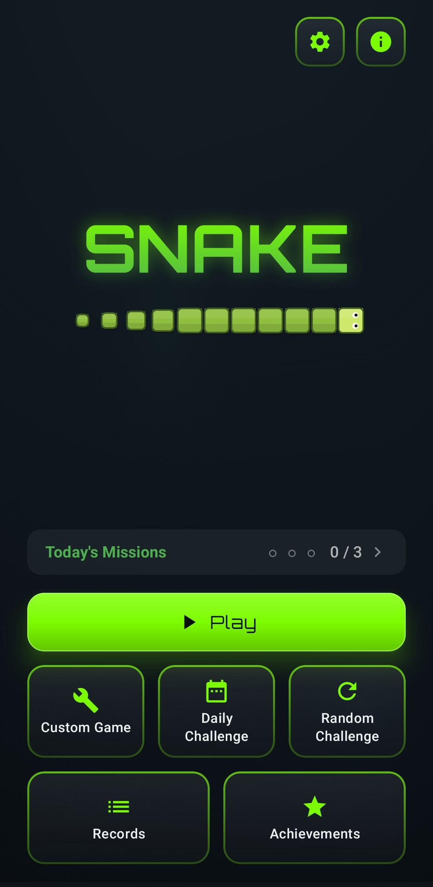
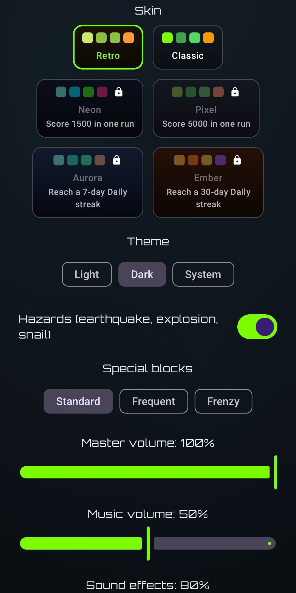
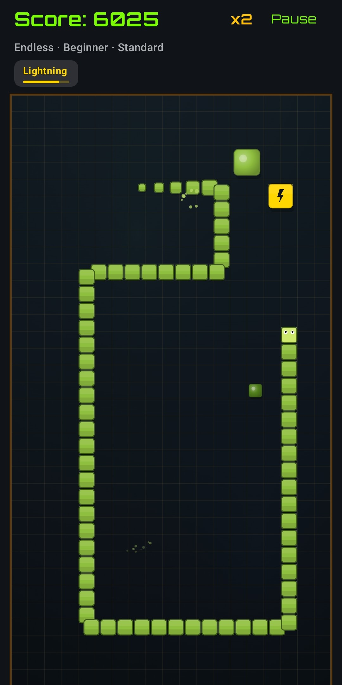
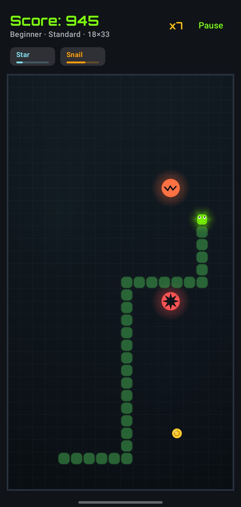
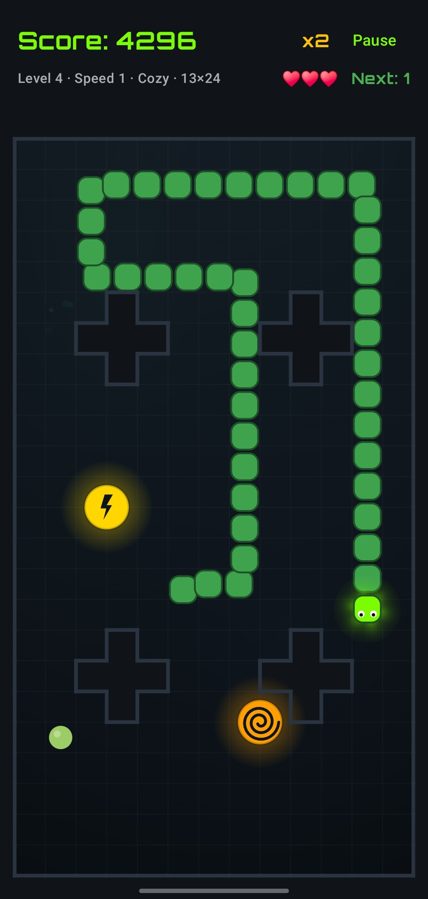

# 🐍 Snake - Android (Kotlin + Jetpack Compose)

[](https://kotlinlang.org/)
[](https://developer.android.com/jetpack/compose)
[](https://www.android.com/)
[](https://developer.android.com/)
[](https://developer.android.com/)
[](https://www.gnu.org/licenses/gpl-3.0)

**Inspired by the classic Snake** and reimagined as a **native Android game** in **Kotlin + Jetpack Compose**,
on the way to a polished, **Google-Play-publishable** title with animation, particles, shaders, audio and menus.

---

## Screenshots

<table>
  <tr>
    <td align="center"><br/><sub>Splash intro</sub></td>
    <td align="center"><br/><sub>Main menu</sub></td>
    <td align="center"><br/><sub>Settings</sub></td>
  </tr>
  <tr>
    <td align="center"><br/><sub>Classic gameplay</sub></td>
    <td align="center"><br/><sub>Power-ups &amp; hazards</sub></td>
    <td align="center"><br/><sub>Campaign - Level 4</sub></td>
  </tr>
</table>

---

## 🎯 Features

The classic Snake mechanics, extended with configurable features so every run feels different:

- 🚀 **Branded launch** - an animated splash flows into a short, skippable brand intro played out on
  the game board itself: a snake crawls across and the word **SNAKE** forms in glowing cells in its
  wake, then it slips off-screen and the menu fades in.
- 🍽️ **Two food categories** - **grow** food makes the snake longer; **shrink** food trims it back.
- 🔠 **Magnitude tiers + maxi sizes** - each category comes in several strengths, and a 2×2 **maxi**
  variant that amplifies the effect.
- ❓ **Mystery pieces** - a "?" food per category with a random amount.
- ⏳ **Time-gated progression** - early on you only see growing food; shrink, maxi and mystery pieces
  unlock as the session goes on (sooner on harder levels), so a run ramps up in difficulty.
- 💨 **Fresh board** - a regular food you ignore for too long fades away (with a little vanish burst)
  and reappears elsewhere, so looping around without eating won't stall the run. Special pieces stick
  around much longer (they're rare events worth reaching) but eventually time out too.
- ✖️ **Combo multiplier** - eating in quick succession multiplies your score (up to ×5).
- 🚧 **Obstacles** - symmetric blocks that tend to clump into larger shapes and raise the difficulty.
- 🎚️ **Levels & snake speed** - 5 obstacle layouts (*Beginner* → *Legend*) and 5 **independent**
  speeds (*Relaxed* → *Turbo*), mixable freely: play the dense Legend field at a gentle pace, or an
  open board flat out.
- 📐 **Responsive board** - pick a granularity (*Cozy* / *Standard* / *Epic* / *Colossal*); the grid
  is computed from your device's screen so it fills the display with square cells in portrait. Bigger
  boards also give food, power-ups and hazards proportionally more time before they vanish, so the
  snake can reach them across the longer distances.
- 🎮 **Control schemes** - **swipe** by default, or a two-button *relative* steering / classic D-pad.
- 🎨 **Skins** - four selectable looks (**Classic / Neon / Retro / Pixel**), each its own palette and
  cell shape (Pixel is flat & square, Neon bubbly), all available immediately in Settings.
- 🌗 **Theme** - choose **Light**, **Dark** or **System** (follows the device) in Settings.
- 🔊 **Music & sound effects** - looping background music that crossfades between the menu and
  gameplay, plus SFX for eating, shrinking, mystery pieces, game over and UI. Independent
  **master / music / SFX** volume sliders in Settings; audio pauses when the app is backgrounded.
- ✨ **GPU shader effects** - an animated background, a glowing snake head and pulsing
  halos on rare foods, all via **AGSL** `RuntimeShader`s, plus an optional **retro CRT filter**
  toggle in Settings.
- ⚡ **Power-ups & hazards** - rare maxi pieces that appear later in a run: **Lightning** (speed up),
  **Snail** (slow down), **Star** (invincible pass-through; the snake blinks faster as it runs out),
  **Freeze**, **Jackpot** (big bonus),
  plus the hazards **Earthquake** (bites a chunk off your tail and scatters those segments across the
  board as lethal, fading debris), **Explosion** (splits the snake, leaving lethal debris) and **3D**
  (the board tilts into a behind-the-head chase-cam and you play in perspective for the duration, with
  the steering switched to relative left/right turns). Active
  effects show countdown chips; up to **two specials** can share the board at once. Toggle **Hazards**
  off in Settings for a calmer run, or dial how often specials appear with the **Special blocks**
  setting (*Standard / Frequent / Frenzy*) - the higher tiers also bring specials online earlier in a
  run. **Time Attack** adds two exclusive clock pieces: a green **+5s** bonus and a red **−3s**
  penalty, each with a floating callout.
- 🏆 **Records screen** - a best-score table per difficulty × board scale (and per mode), reachable
  from the main menu.
- 🎖️ **Achievements** - eighteen local milestones (combos, scores, endurance, eating sprees, using power-ups…)
  that unlock as you play, with a dedicated screen and an unlock banner on the game-over screen.
- 🕹️ **Game modes** - **Classic**, **Endless** (speed ramps up the longer you survive),
  **Time Attack** (score as much as you can in 120s) and **Campaign** (see below), selectable on the
  start screen.
- 🧊 **3D World** - a **View** toggle on the start screen that plays **any** mode entirely in the
  behind-the-head 3D chase-cam (at a slightly eased pace, with relative left/right steering), instead
  of the flat top-down board. The choice is remembered between sessions.
- 🧩 **Campaign mode** - ten **designed board shapes** (cut corners, pillars, chambers, a vault…)
  that repeat forever, one **speed step faster** each lap. Eat **12 foods** to clear a level; you
  start with **3 lives** (a crash respawns you in the same level, keeping score and progress) and a
  rare 2×2 **extra-life** piece with a snake-head icon can bank more (up to 5). Every transition
  plays an animated *"Level x · Speed x"* banner with a 3-second countdown. The Level and Snake speed
  selectors are disabled here - the mode has its own layouts and pace - and the Records screen tracks both your best
  score and the deepest level you reached per board scale.
- ⏸️ **Pause & menus** - pause overlay with a blur effect; restart or return to the main menu at any time. Highscores are kept per (mode, level, board scale).
- 💎 **Polished navigation** - an **animated GPU background** behind the menus, a **decorated main menu** (a gliding snake that follows your selected skin), and **blur-dissolve** screen transitions.
- 📜 **Credits screen** - an in-app **Credits / About** page (author, license and asset attribution), reachable from the main menu.

### 🍽️ Food system at a glance

| Category | Tiers (standard growth/shrink) | Maxi (2×2) | Mystery "?" | Score |
|----------|-------------------------------|------------|-------------|-------|
| 🟢 **Grow**   | +2 / +4 / +6 / +8 | doubles the amount | random +2…+24 | `+10 × growth × combo` |
| 🟠 **Shrink** | −2 / −3 / −5      | doubles the amount | random −2…−14 | small symbolic bonus (5 / 10 maxi) |

The snake never shrinks below **3 segments**. Grow food drives the score (scaled by the combo
multiplier); shrink food is a tactical tool - it gives only token points but lets you cut your length
to manoeuvre. Eating either floats the amount of segments gained or lost (**+N** / **−N**) at the food.

### ⚔️ Levels (obstacles)

The **Level** sets only how many obstacles are placed; it no longer affects speed (see *Snake speed*
below), so any level can be paired with any pace.

| Level | Name        | Obstacles |
|-------|-------------|-----------|
| 1     | Beginner    | 0         |
| 2     | Adventurer  | 8         |
| 3     | Warrior     | 15        |
| 4     | Champion    | 25        |
| 5     | Legend      | 40        |

Obstacles are laid out with **4-fold symmetry** (mirrored left/right and top/bottom), with a clear
margin next to every wall and a clear zone around the snake's spawn. New blocks are biased towards
growing next to ones already placed, so they tend to form larger clumped shapes instead of
scattering as isolated cells.

### 🏃 Snake speed

A separate setting (shown under *Level* on the start screen and in Settings) controls the pace,
independent of the obstacle layout. It applies to **Classic** and **Time Attack**; Endless ramps its
own pace and Campaign uses its per-lap speed cycle.

| Speed | Name    | Tick (ms) |
|-------|---------|-----------|
| 1     | Relaxed | 175       |
| 2     | Steady  | 150       |
| 3     | Brisk   | 125       |
| 4     | Rapid   | 100       |
| 5     | Turbo   | 75        |

### 📐 Board scale

The board is **responsive**: pick a granularity and the grid is computed from your device's play-area
aspect ratio so the board fills the screen with square cells. The preset count is applied
to the **short side**, so the cell size - and the feel - stays consistent across different screen
sizes (a tablet gets the same density as a phone, not a squashed few-row board).

| Scale    | Cell size  | Cells on short side |
|----------|------------|---------------------|
| Cozy     | larger     | 13                  |
| Standard | medium     | 19                  |
| Epic     | smaller    | 27                  |
| Colossal | smallest   | 35                  |

The counts are odd on purpose: the board gets a true middle column, so the snake's centred spawn
lines up exactly with centred overlays (like the Campaign-mode countdown).

---

## 🛠️ Requirements & tools

Install on your development machine:

- **Android Studio** (latest stable) - bundles the JDK (JBR), the SDK Manager and the AVD emulator.
- **Android SDK** via the SDK Manager: **Platform API 36**, **Build-Tools 36.x**, **Platform-Tools** (`adb`),
  **Emulator** + a system image (e.g. API 36).
- A **test target**: an AVD emulator or a physical device with **USB debugging** enabled.
- **Gradle**: not needed globally - the project ships the **Gradle wrapper** (`./gradlew`).

The project targets `minSdk 33` (Android 13) and `compileSdk`/`targetSdk 36` (Android 16) - a modern
baseline so AGSL GPU effects and other recent APIs are available without fallback code.

---

## 🚀 Build & run

1. **Clone**:
   ```bash
   git clone https://github.com/fiorenzobrioni/snake-game.git
   ```
2. **Open the repository root** in **Android Studio** and let Gradle sync.
3. **Run** on an emulator or a connected device (▶ Run, or):
   ```bash
   ./gradlew installDebug      # build + install the debug APK
   ./gradlew assembleDebug     # build the debug APK only
   ```

> The Android SDK location is read from `local.properties` (created by Android Studio) or the
> `ANDROID_HOME` environment variable.

---

## 🎮 How to play

Guide the snake around the board, eat food to grow and score, and avoid the walls, the obstacles and your
own body.

**Food:** green = grow, warm/orange = shrink, "?" = a mystery amount. Bigger (2×2 maxi) pieces and the
mystery and shrink foods only start appearing as the session runs on - so each run gets more eventful.
Chain bites together to build a **combo** and multiply your score, and use shrink food to cut your length
when the board gets tight (you never drop below 3 segments).

**Controls (touch):** by default you **swipe** anywhere on the board to change direction. Prefer
buttons? Switch in **Settings** to a **two-button** scheme (turn left / right relative to the snake's
heading) or the classic **D-pad** - your choice is saved. 180° reversals are blocked, so you can't
instantly fold back into your own body. Pick a level and board scale on the start screen; pause and
restart from the in-game controls. Your best score is kept per (level, scale).

**Audio:** the game plays looping background music (it crossfades between the menu and gameplay) and
sound effects for eating, shrinking, mystery pieces, game over and button taps. Tune the **master**,
**music** and **SFX** volumes independently in **Settings** (set any to zero to mute); the music
automatically pauses when you leave the app and yields to other apps' audio.

**Game modes:** choose your mode on the start screen - **Classic** (survive as long as you can),
**Endless** (the snake keeps accelerating the longer you survive), **Time Attack** (score as much
as possible in 120 seconds - watch for the exclusive **+5s** / **−3s** clock pieces that stretch or
shave your remaining time), **Campaign** (clear ten shaped boards by eating 12 foods each, with 3
lives, an exclusive 2×2 extra-life piece, and a speed-up every completed lap - the HUD shows
*Level x · Speed x*, your hearts and the foods still to go). Your best score is tracked per mode,
level and board scale; check the **Records** screen from the main menu.

**3D World:** on the start screen, switch the **View** to **3D World** to play *any* mode entirely in
the behind-the-head 3D chase-cam - the board tilts into perspective as the run starts, the pace is
eased a little for playability, and steering becomes relative left/right turns (swipe horizontally, or
the two-button control). Switch it back off for the classic flat top-down board. Your choice is
remembered between sessions.

**Power-ups & hazards:** as a run progresses, rare special pieces start appearing on the board.
Power-ups help: **Lightning** speeds the snake up, **Snail** slows it down, **Star** grants brief
invincibility (you can pass through walls, obstacles and your own body - the snake blinks as the
effect fades), **Freeze** pauses further specials for a strategic breather, and **Jackpot** grants a
large score bonus. Hazards hinder: **Earthquake** bites a chunk off your tail and flings those
segments across the board as lethal debris (it fades after a few seconds); **Explosion** splits the
snake in two - the detached segment turns into lethal debris until it auto-clears; and **3D** briefly
freezes the action while the board tilts forward into a chase-cam mounted behind and above the snake's
head, then hands play back in that perspective view for the duration (steering becomes relative
left/right turns) before tilting back to the flat top-down. Active effects show
a countdown chip in the HUD. **Time Attack** also has two clock-only pieces - a **+5s** bonus and a
**−3s** penalty. Toggle **Hazards** off in **Settings** for a calmer run (this also hides the time
penalty), or raise **Special blocks** to *Frenzy* for constant chaos.

**Achievements:** milestones unlock automatically as you play - high combos, long runs, using
power-ups, and more. A banner appears on the game-over screen when one unlocks; browse the full list
from the main menu.

---

## 👨‍💻 Code layout

```
app/src/main/kotlin/com/brioni/snake/
├── MainActivity.kt     # Compose entry point
├── game/               # pure-Kotlin game model (no Android imports → unit-testable)
├── ui/                 # Compose UI + Material 3 theme
├── audio/              # SoundPool SFX + MediaPlayer music, behind the GameAudio facade
└── data/               # DataStore persistence (settings, highscores)
```

The sound effects in `app/src/main/res/raw/` are original CC0 clips generated by
[`tools/audio/generate_audio.py`](tools/audio/generate_audio.py) - re-run it to reproduce them. The
background music tracks (`music_menu.ogg`, `music_game.ogg`) are generated with Google Gemini (see
[Media assets & credits](#-media-assets--credits)). The AGSL shaders live in
[`ui/game/Shaders.kt`](app/src/main/kotlin/com/brioni/snake/ui/game/Shaders.kt).

For architecture notes, conventions and the file map, see [`CLAUDE.md`](CLAUDE.md).

---

## 🎵 Media assets & credits

The app includes a **Credits** screen, reachable from the main menu, summarizing authorship and asset
attribution. In short:

- **Author** - Fiorenzo Brioni. Released as free software under the **GNU GPL v3.0**.
- **Music** - the looping menu and gameplay tracks are **generated with Google Gemini** (Lyria), used
  in accordance with [Google's generative-AI terms of service](https://policies.google.com/terms/generative-ai).
  They are bundled as OGG/Vorbis and post-processed in-repo (silence trimmed and an equal-power
  self-crossfade baked in) so they loop seamlessly. As aggregated assets they sit alongside - and do
  not affect the license of - the GPL-3.0 source code.
- **Sound effects** - original, synthesized in-repo (CC0) by
  [`tools/audio/generate_audio.py`](tools/audio/generate_audio.py).
- **Fonts** - Orbitron (SIL Open Font License 1.1).
- **Graphics & shaders** - original, hand-written in-repo.
- **Built with** - developed with Google Antigravity and Claude Code.

Full per-asset details and licenses are tracked in [`docs/CREDITS.md`](docs/CREDITS.md).

---

## 🧭 Planning & Roadmap

The full development plan - from foundations through gameplay, visual polish, audio, shaders, content, and
**Google Play distribution** - as well as active TODOs, bugs, and architecture notes, is in [`PLANNING.md`](PLANNING.md).

---

## 🏛️ Legacy - the v1.0.0 prototype

This project began as a **learning exercise**: a Snake built in **C# / .NET 10 / Windows Forms** with **GDI+**
rendering, shipped as **v1.0.0**. That desktop version is **frozen** and preserved under
[`legacy/SnakeGame/`](legacy/SnakeGame/) as a reference for the game model. See
[`legacy/README.md`](legacy/README.md) for its build notes. The native Android app described above is the
project's active direction.

---

## 📄 License

Copyright (C) 2026 Fiorenzo Brioni

This project is free software: you can redistribute it and/or modify it under the terms of the
**GNU General Public License v3.0** as published by the Free Software Foundation.

Distributed in the hope that it will be useful, but **without any warranty**; without even the
implied warranty of merchantability or fitness for a particular purpose.
See the [LICENSE](LICENSE) file for the full terms.
